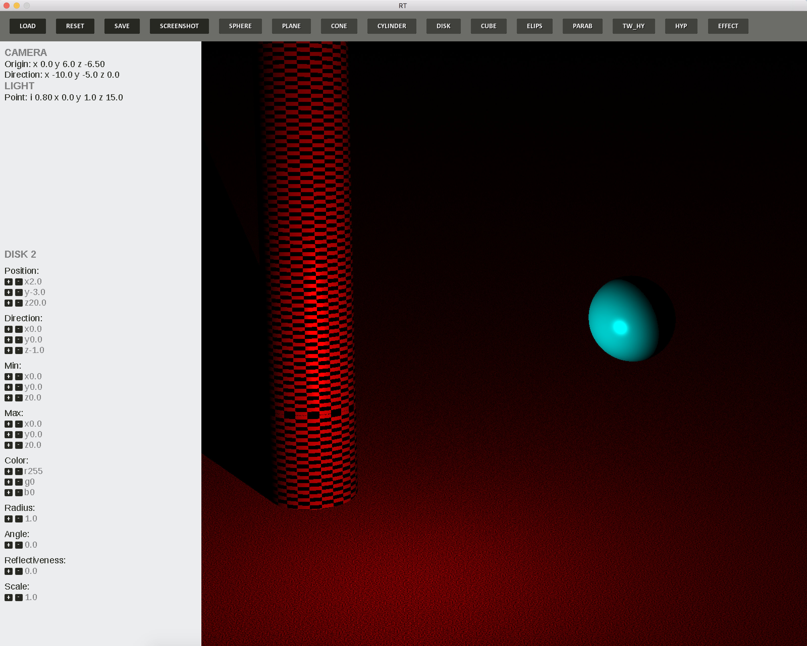
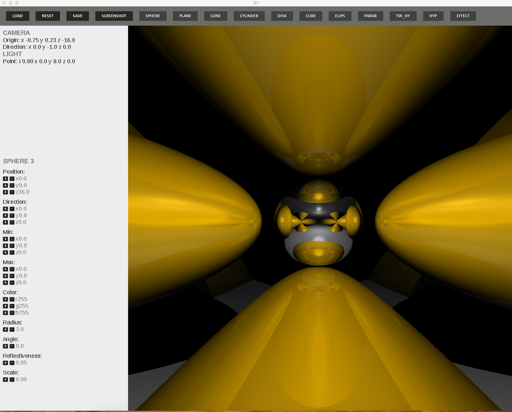
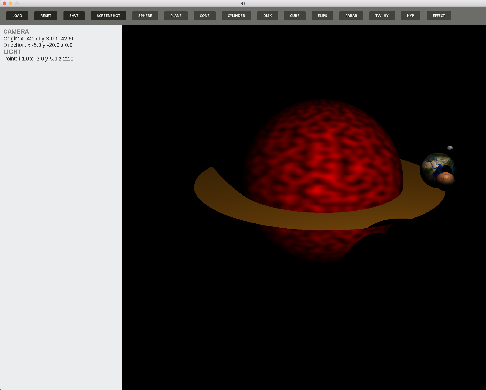
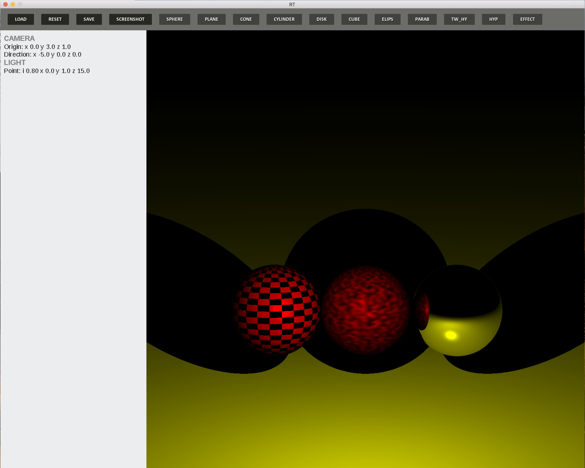
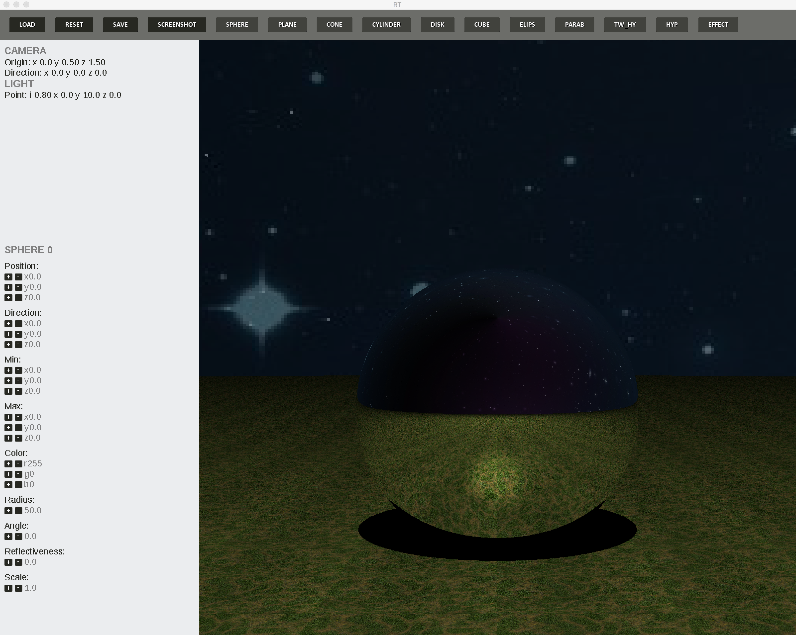

<h1>Description</h1>
Program that allow you create and manipulate with different 3d objects using raytracing algorithm. This program developed with OpenCl for parallel computing and SDL for GUI.
<h1>Features</h1>

- Scene and objects managing.

- Change size, color, reflectivity and position of any object.

- Make a screenshot and create new scene.

- You can move in any direction and rotate the camera.

- Apply different effects to the scene.

 - WASD - moving, arrows - rotating
<h1>Examples</h1>

<h1>Install && Launch</h1>

- git clone https://github.com/pavelrosh/RT.git ~RT 

- cd RT

- make

- ./RT scene/your scene 

